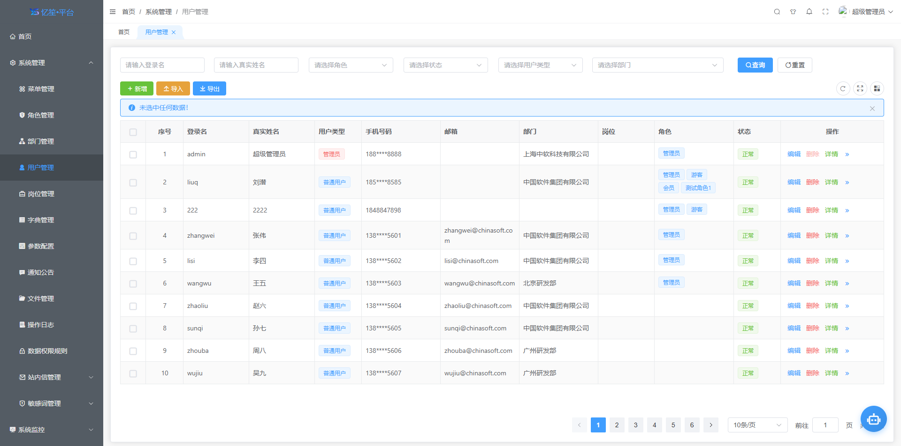
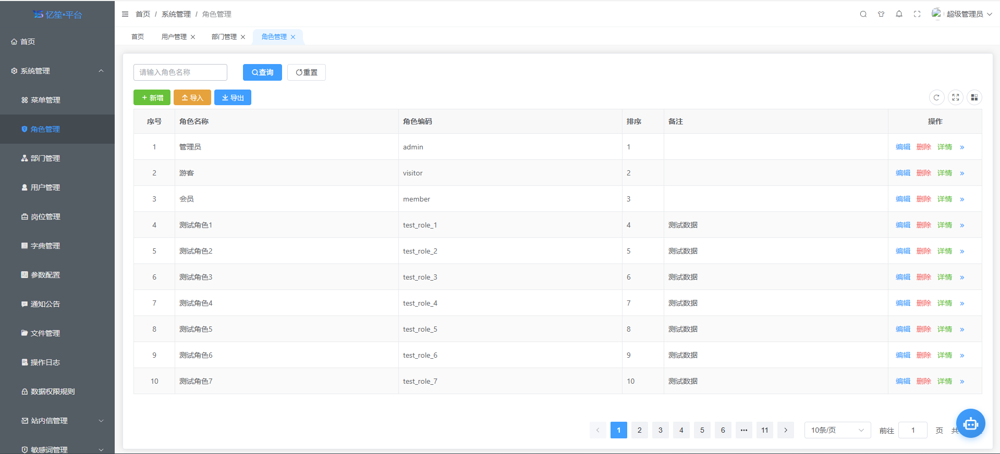
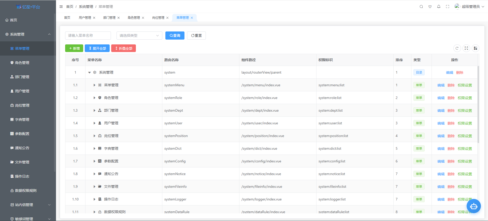
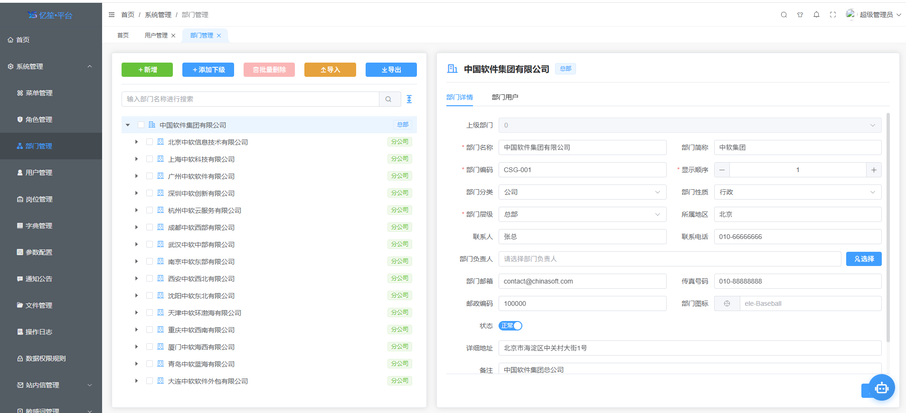
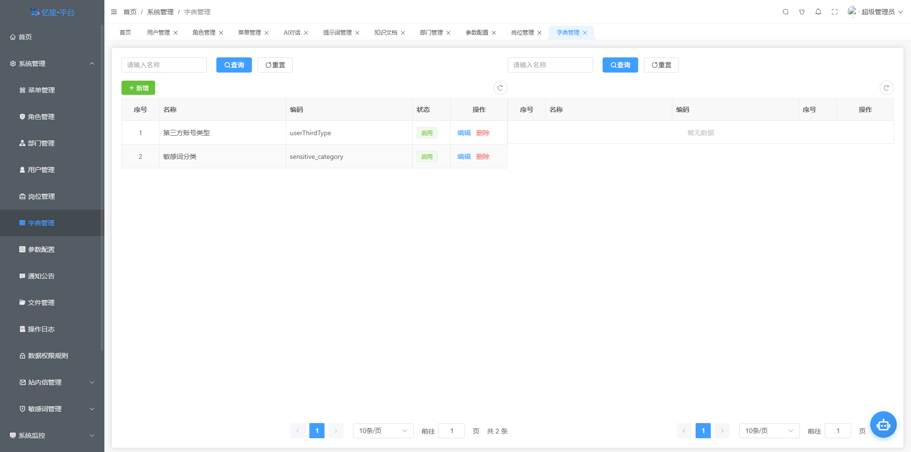

<div align="center">
  
  <h1>忆笙代码平台 (YsCode)</h1>
  <p>🚀 企业级低代码开发平台 - 基于 Spring Boot 3.x + Vue 3 的全栈解决方案</p>
  <p>让开发更高效、更智能、更简单</p>
</div>

---

<p align="center">
 
 
 
 
 
 
</p>

## 💡 核心价值

### 项目定位

**忆笙代码平台 (YsCode)** 是一套面向企业级应用开发的低代码开发平台，采用业界领先的前后端分离架构，深度融合 AI 智能技术，旨在帮助开发团队和企业大幅降低软件开发成本，提升交付效率，实现业务快速落地。

### 目标用户

- 👨‍💻 **软件开发团队**：快速搭建企业级中后台管理系统
- 🏢 **企业 IT 部门**：降低开发成本，缩短项目交付周期
- 🚀 **创业公司**：快速验证产品原型，加速业务上线
- 🎓 **技术学习者**：学习企业级架构设计和最佳实践

### 解决的核心问题

| 痛点         | 解决方案                  |
| ---------- | --------------------- |
| 重复CRUD开发耗时 | 可视化代码生成器，一键生成前后端代码    |
| 数据导入导出复杂   | Excel处理中心，百万级数据流式处理   |
| 系统权限难以管控   | 企业级RBAC权限体系，数据权限精细化控制 |
| AI集成门槛高    | 多供应商AI统一接入，开箱即用       |
| 文件存储不统一    | 支持6种存储方式，灵活切换         |
| 系统监控缺失     | 实时监控服务器、Redis、在线用户    |

### 独特优势

- 🏆 **AI原生设计**：深度融合 Spring AI，支持多模型流式对话
- 🏆 **企业级安全**：Sa-Token权限框架，敏感数据自动脱敏
- 🏆 **高性能架构**：Redis缓存、异步任务、WebSocket实时推送
- 🏆 **多数据库支持**：MySQL、Oracle、PostgreSQL、SQL Server、达梦、人大金仓
- 🏆 **现代化UI**：Element Plus + Vxe-Table，5种布局模式

***

## 📖 项目简介

**忆笙代码平台 (YsCode)** 是一套企业级低代码开发平台，采用前后端分离架构，集成了系统管理、代码生成器、AI智能助手、系统监控等丰富功能，旨在帮助开发者快速构建企业级中后台管理系统。

> 📝 **命名由来**："忆笙"寓意"追忆初心，笙声不息"，YsCode 代表 "YiSheng Code"，象征着对代码质量的追求和对技术创新的坚持。

### 核心特性

- 🚀 **低代码开发**：可视化代码生成器，支持多数据源、自定义模板
- 🤖 **AI智能助手**：集成多供应商大模型（OpenAI、DeepSeek、智谱AI、MiniMax、Ollama等），支持流式对话、RAG知识库
- 📊 **Excel处理中心**：百万行流式处理，智能字段映射，全维度数据校验
- 🔐 **企业级安全**：Sa-Token权限框架，数据权限控制，敏感数据脱敏
- 📁 **多存储支持**：本地、MinIO、阿里云OSS、腾讯云COS、AWS S3、RustFS
- ⚡ **高性能**：Redis缓存、异步任务、WebSocket实时推送
- 🎨 **现代化UI**：Element Plus + Vxe-Table，支持多种布局模式

***

## 🏗️ 项目架构

```
YsCode/
├── ys-boot-pro/              # 后端项目（Spring Boot）
│   ├── ys-common/            # 公共支撑层
│   ├── ys-infra/             # 基础设施层
│   │   ├── ys-infra-file/    # 文件上传模块（6种存储方式）
│   │   ├── ys-infra-log/     # 系统日志模块（操作/登录/异常）
│   │   ├── ys-infra-dict/    # 字典翻译模块
│   │   ├── ys-infra-enum/    # 枚举翻译模块
│   │   ├── ys-infra-sensitive/# 敏感数据脱敏模块
│   │   ├── ys-infra-quartz/  # 定时任务模块（集群支持）
│   │   ├── ys-infra-datapermission/  # 数据权限模块
│   │   ├── ys-infra-excel/   # Excel导入导出模块（百万级）
│   │   ├── ys-infra-codegen/ # 代码生成器模块（多数据源）
│   │   ├── ys-infra-ai/      # AI智能模块（多模型适配）
│   │   ├── ys-infra-redis/   # Redis缓存模块
│   │   └── ys-infra-monitor/ # 系统监控模块
│   ├── ys-system/            # 系统业务模块
│   ├── ys-module/            # 业务模块父模块
│   └── ys-starter/           # 应用启动模块
│
└── ys-vue-pro/               # 前端项目（Vue 3）
    ├── src/
    │   ├── api/              # API接口层
    │   ├── components/       # 公共组件（YsTable/YsDialog/YsUpload等）
    │   ├── views/            # 页面视图
    │   ├── stores/           # Pinia状态管理
    │   ├── router/           # 路由配置
    │   ├── layout/           # 布局组件（5种布局）
    │   └── utils/            # 工具函数
    └── ...
```

***

## 🛠️ 技术栈

### 后端技术栈

| 技术               | 版本       | 说明                        |
| ---------------- | -------- | ------------------------- |
| **Spring Boot**  | 3.3.3    | 核心框架                      |
| **Spring Cloud** | 2023.0.3 | 微服务框架（预留）                 |
| **Spring AI**    | 1.1.2    | AI框架（OpenAI/DeepSeek/智谱等） |
| **MyBatis-Plus** | 3.5.14   | ORM框架                     |
| **Sa-Token**     | 1.43.0   | 认证授权框架                    |
| **MySQL**        | 8.4.0    | 数据库                       |
| **Redis**        | 8.3      | 缓存数据库, 向量数据库                    |
| **Druid**        | 1.2.28   | 数据库连接池                    |
| **Knife4j**      | 4.4.0    | API文档                     |
| **EasyExcel**    | 4.0.3    | Excel处理                   |
| **Quartz**       | 2.5.0    | 定时任务                      |

### 前端技术栈

| 技术                     | 版本     | 说明      |
| ---------------------- | ------ | ------- |
| **Vue**                | 3.4.21 | 前端框架    |
| **TypeScript**         | 5.4.2  | 类型系统    |
| **Vite**               | 5.1.6  | 构建工具    |
| **Element Plus**       | 2.6.1  | UI组件库   |
| **vxe-table**          | 4.15.2 | 高性能表格   |
| **vue-element-plus-x** | 1.3.98 | AI聊天组件库 |
| **Pinia**              | 2.1.7  | 状态管理    |
| **Vue Router**         | 4.3.0  | 路由管理    |
| **ECharts**            | 5.5.0  | 图表库     |
| **axios**              | 1.6.8  | HTTP请求  |

***

## 🚀 快速开始

### 环境要求

- **JDK**: 21+
- **Node.js**: 18+
- **MySQL**: 8.0+
- **Redis**: 6.0+
- **Maven**: 3.8+

### 后端启动

```bash
# 进入后端目录
cd ys-boot-pro

# 编译打包
mvn clean package -DskipTests

# 启动应用（方式1：IDEA运行 YsApplication.java）
# 启动应用（方式2：命令行）
mvn spring-boot:run -pl ys-starter

# 访问地址
# API文档: http://localhost:8910/ysblog/doc.html
# Druid监控: http://localhost:8910/ysblog/druid/
```

### 前端启动

```bash
# 进入前端目录
cd ys-vue-pro

# 安装依赖
npm install

# 开发模式启动
npm run dev

# 访问地址: http://localhost:8888
```

### 生产部署

```bash
# 前端构建
npm run build

# 后端打包
mvn clean package -DskipTests

# 部署 ys-starter/target/ys-starter-*.jar
java -jar ys-starter-*.jar
```

***

## 📸 功能截图

### 登录页面

> 【页面截图预留位置】
>
> 路径：`docs/images/login.png`
>
> 说明：系统登录界面，支持账号密码、手机号、扫码登录

### 系统首页

> 【页面截图预留位置】
>
> 路径：`docs/images/dashboard.png`
>
> 说明：数据可视化仪表盘，展示系统核心指标

### 用户管理

 

> 说明：用户增删改查、角色分配、部门分配、导入导出

### 角色管理

 

> 说明：角色权限配置、菜单权限、数据权限

### 菜单管理

 

> 说明：动态路由配置、菜单权限控制、按钮权限

### 部门管理


 

> 说明：组织架构管理、树形结构展示、部门人员管理

### 字典管理

 

> 说明：数据字典维护、字典项管理、自动翻译

### AI智能助手

> 【页面截图预留位置】
>
> 路径：`docs/images/ai-chat.png`
>
> 说明：AI对话聊天、多模型切换、流式输出、深度思考、文件上传

### AI模型管理

> 【页面截图预留位置】
>
> 路径：`docs/images/ai-model.png`
>
> 说明：AI模型配置、供应商管理、参数设置、调用日志

### 代码生成器

> 【页面截图预留位置】
>
> 路径：`docs/images/codegen-config.png`
>
> 说明：可视化代码生成、多数据源、模板集管理、五步生成向导

### 代码模板编辑

> 【页面截图预留位置】
>
> 路径：`docs/images/codegen-template.png`
>
> 说明：Monaco编辑器、Velocity模板语法、在线预览、版本管理

### Excel导入

> 【页面截图预留位置】
>
> 路径：`docs/images/excel-import.png`
>
> 说明：智能字段映射、数据预览、批量导入、错误报告

### Excel导出

> 【页面截图预留位置】
>
> 路径：`docs/images/excel-export.png`
>
> 说明：导出任务管理、异步导出、进度追踪、样式配置

### 文件管理

> 【页面截图预留位置】
>
> 路径：`docs/images/system-file.png`
>
> 说明：文件上传、分片上传、断点续传、多存储方式、在线预览

### 系统监控-服务器

> 【页面截图预留位置】
>
> 路径：`docs/images/monitor-server.png`
>
> 说明：CPU、内存、磁盘、网络、JVM实时监控

### 系统监控-Redis

> 【页面截图预留位置】
>
> 路径：`docs/images/monitor-redis.png`
>
> 说明：Redis监控、内存使用、键值统计、连接信息

### 定时任务

> 【页面截图预留位置】
>
> 路径：`docs/images/monitor-quartz.png`
>
> 说明：定时任务管理、Cron表达式、执行日志、集群支持

### 操作日志

> 【页面截图预留位置】
>
> 路径：`docs/images/system-log.png`
>
> 说明：操作审计日志、登录日志、异常记录、日志分析

### 通知公告

> 【页面截图预留位置】
>
> 路径：`docs/images/system-notice.png`
>
> 说明：公告发布、富文本编辑、阅读统计、弹窗通知

### 个人中心

> 【页面截图预留位置】
>
> 路径：`docs/images/user-profile.png`
>
> 说明：个人信息、密码修改、操作记录

***

## 📚 核心功能模块

### 1. 系统管理

| 功能    | 说明                         | 特点                          |
| ----- | -------------------------- | --------------------------- |
| 用户管理  | 用户CRUD、角色分配、部门分配、密码管理、导入导出 | Excel批量导入导出、数据权限隔离          |
| 角色管理  | 角色CRUD、菜单权限、数据权限配置         | 支持数据范围控制（全部/本部门/本部门及以下/仅本人） |
| 菜单管理  | 菜单CRUD、动态路由、权限标识、按钮权限      | 支持外链、内嵌iframe、组件缓存          |
| 部门管理  | 部门CRUD、树形结构、组织架构、部门人员      | 懒加载树形展示、部门数据隔离              |
| 岗位管理  | 岗位CRUD、用户关联                | 用户多岗位支持                     |
| 字典管理  | 字典类型、字典数据、缓存管理、自动翻译        | @DictTranslate注解自动翻译        |
| 参数管理  | 系统参数配置、动态调整                | 支持热更新                       |
| 通知公告  | 公告发布、富文本编辑、阅读统计            | 实时弹窗通知、已读未读追踪               |
| 消息管理  | 站内消息、消息模板、消息推送             | 支持模板变量、批量发送                 |
| 文件管理  | 文件上传、存储配置、文件预览             | 6种存储方式、在线预览                 |
| 日志管理  | 操作日志、登录日志、异常日志             | 异步记录、日志分析                   |
| 敏感词管理 | 敏感词库、白名单、检测日志              | 自动过滤、替换策略                   |

### 2. AI智能助手

| 功能    | 说明                                                          | 技术亮点              |
| ----- | ----------------------------------------------------------- | ----------------- |
| AI对话  | 多轮对话、流式输出、打字机效果、深度思考                                        | WebFlux响应式流、SSE推送 |
| 模型管理  | 多供应商配置（OpenAI、DeepSeek、智谱AI、MiniMax、Moonshot、Doubao、Ollama） | Spring AI统一适配     |
| 提示词管理 | 提示词模板、变量替换、快捷使用                                             | 支持占位符动态替换         |
| 会话管理  | 历史会话、会话标题、删除管理                                              | 会话持久化、消息上下文       |
| 知识库   | RAG检索增强、文档向量化、智能分块                                          | Redis向量存储、语义检索    |
| 调用日志  | API调用记录、Token消耗统计                                           | 异步记录、性能监控         |
| 意图识别  | 智能意图识别、规则配置                                                 | 基于AI的意图分类         |
| 错误知识库 | 错误解决方案积累、智能推荐                                               | 知识沉淀、快速定位         |

### 3. 代码生成器

| 功能    | 说明                        | 特点                                          |
| ----- | ------------------------- | ------------------------------------------- |
| 数据源管理 | 多数据源配置、数据库连接测试            | 支持MySQL/Oracle/PostgreSQL/SQLServer/达梦/人大金仓 |
| 表选择   | 数据表浏览、字段查看、主键识别           | 元数据自动读取                                     |
| 模板集管理 | 模板集CRUD、模板关联、团队共享         | 支持版本管理                                      |
| 模板管理  | Monaco编辑器、Velocity语法、在线预览 | 语法高亮、实时预览                                   |
| 参数配置  | 包名配置、作者信息、表前缀、字段映射        | 灵活配置                                        |
| 代码预览  | 实时预览、批量生成、下载代码            | 支持单表/多表批量生成                                 |
| 五步向导  | 数据源→表选择→模板集→参数配置→预览生成     | 可视化引导                                       |

### 4. Excel处理中心

| 功能   | 说明                   | 性能指标          |
| ---- | -------------------- | ------------- |
| 导入配置 | 字段映射、校验规则、别名库        | 百万级数据流式处理     |
| 导入任务 | 文件上传、数据预览、批量导入、错误报告  | 异步处理、进度实时推送   |
| 导出配置 | 导出模板、字段选择、条件配置、样式配置  | 支持复杂样式、大数据量导出 |
| 导出任务 | 异步导出、进度追踪、文件下载       | WebSocket进度推送 |
| 任务中心 | 任务列表、状态查看、重新执行       | 任务持久化、失败重试    |
| 数据校验 | 全维度校验（必填/格式/唯一性/自定义） | 错误精确定位        |

### 5. 系统监控

| 功能      | 说明                     | 监控维度          |
| ------- | ---------------------- | ------------- |
| 服务器监控   | CPU、内存、磁盘、JVM、网络实时监控   | WebSocket实时推送 |
| Redis监控 | 内存使用、键值统计、连接信息         | 命令统计、慢查询分析    |
| 在线用户    | 在线用户列表、强制下线            | Session管理     |
| 定时任务    | 任务管理、Cron表达式、执行日志、暂停恢复 | 集群支持、分布式锁     |
| 数据权限    | 数据规则配置、角色数据范围          | 动态SQL拦截       |

***

## 🔧 配置说明

### 后端配置

**数据库配置** (`application-dev.yml`):

```yaml
spring:
  datasource:
    url: jdbc:mysql://localhost:3306/ys-blog?characterEncoding=UTF-8&useUnicode=true&useSSL=false&serverTimezone=Asia/Shanghai
    username: root
    password: your_password
```

**Redis配置**:

```yaml
spring:
  data:
    redis:
      host: 127.0.0.1
      port: 6379
      password: your_password
      database: 0
```

**文件存储配置**:

```yaml
file:
  storage:
    type: local  # 可选: local/minio/oss/cos/s3/rustfs
    local:
      upload-path: /data/upload
```

**AI配置**:

```yaml
spring:
  ai:
    openai:
      api-key: your_api_key
      base-url: https://api.openai.com
    deepseek:
      api-key: your_api_key
    zhipuai:
      api-key: your_api_key
```

### 前端配置

**环境配置** (`.env.development`):

```bash
VITE_API_URL = http://127.0.0.1:8910/ysblog/
VITE_PORT = 8888
```

***

## 📖 开发文档

### 后端开发规范

- **Controller层**: 继承 `BaseController`，使用 `@RestController` 注解
- **Service层**: 继承 `BaseService`，实现业务逻辑
- **Mapper层**: 继承 `BaseMapper`，XML文件实现复杂SQL
- **实体类**: 继承 `BaseEntity`，使用Lombok简化代码
- **DTO类**: 继承 `BaseEntityDTO`，用于参数传递

### 前端开发规范

- **页面组件**: 使用 `<script setup>` 语法，添加 `name` 属性
- **API封装**: 按模块组织，使用 `useXxxApi()` 函数式封装
- **表格组件**: 使用 `YsTable` 组件，支持自动高度、分页、跨页选中
- **弹窗组件**: 使用 `YsDialog` 组件，统一弹窗样式

### 注解使用

| 注解                   | 功能     | 使用位置         |
| -------------------- | ------ | ------------ |
| `@MyLog`             | 记录操作日志 | Controller方法 |
| `@DataPermission`    | 数据权限控制 | Controller方法 |
| `@DictTranslate`     | 字典自动翻译 | 实体类字段        |
| `@SensitiveField`    | 敏感数据脱敏 | 实体类字段        |
| `@SaCheckPermission` | 权限校验   | Controller方法 |
| `@RateLimiter`       | 限流控制   | Controller方法 |
| `@AICallLog`         | AI调用日志 | Controller方法 |

***

## 🎯 适用场景

- ✅ 企业级中后台管理系统快速开发
- ✅ 电商平台管理后台
- ✅ 金融系统运营后台
- ✅ 教育系统管理平台
- ✅ 医疗系统管理后台
- ✅ 政务系统管理平台
- ✅ 物联网设备管理平台
- ✅ 大数据可视化平台

***

## 👥 适用人群与二次开发指南

### 适用人群

| 人群类型           | 技术背景               | 使用方式                     |
| -------------- | ------------------ | ------------------------ |
| **全栈开发者**      | 熟悉Java + Vue       | 直接使用代码生成器生成CRUD，快速搭建业务系统 |
| **后端工程师**      | 精通Java/Spring Boot | 专注于业务逻辑开发，前端使用平台生成的标准页面  |
| **前端工程师**      | 精通Vue3/TypeScript  | 基于平台提供的组件库，快速构建交互界面      |
| **技术团队Leader** | 架构设计经验             | 作为团队基础框架，统一技术栈和开发规范      |
| **独立开发者**      | 全栈能力               | 快速交付项目，降低开发成本，提高接单效率     |
| **企业IT部门**     | 内部系统开发             | 构建企业内部应用，实现数字化转型         |
| **培训机构/讲师**    | 教学用途               | 作为企业级开发教学案例，学习最佳实践       |

### 基于本平台可二次开发的项目

#### 1. 企业管理系统

- **OA办公系统**：流程审批、考勤管理、会议管理、公文流转
- **CRM客户关系管理**：客户跟进、销售漏斗、合同管理、业绩统计
- **ERP企业资源计划**：采购管理、库存管理、生产管理、财务管理
- **HRM人力资源管理**：招聘管理、员工档案、薪酬绩效、培训发展
- **项目管理**：任务分配、进度跟踪、工时统计、资源调度

#### 2. 电商平台

- **B2B/B2C商城管理后台**：商品管理、订单处理、营销活动、会员管理
- **供应链管理系统**：供应商管理、采购计划、物流跟踪、仓储管理
- **跨境电商ERP**：多平台店铺管理、海外仓管理、报关清关

#### 3. 行业解决方案

- **智慧教育系统**：课程管理、在线考试、学籍管理、家校互通
- **智慧医疗平台**：预约挂号、电子病历、药品管理、医保对接
- **智慧政务系统**：事项审批、一网通办、数据共享、监管大屏
- **智慧物业系统**：业主管理、收费管理、报修工单、设备巡检
- **智慧园区平台**：门禁管理、停车管理、能耗监控、安防监控

#### 4. 工具类应用

- **内容管理系统(CMS)**：文章发布、栏目管理、评论审核、SEO优化
- **工单系统**：问题提交、工单分配、处理跟踪、满意度评价
- **问卷调查系统**：问卷设计、数据收集、统计分析、报表导出
- **知识库系统**：文档管理、全文检索、版本控制、权限管理

### 二次开发优势

| 优势       | 说明                |
| -------- | ----------------- |
| **快速起步** | 基础功能开箱即用，省去重复造轮子  |
| **规范统一** | 遵循企业级开发规范，代码质量有保障 |
| **易于扩展** | 模块化架构，按需引入功能模块    |
| **AI加持** | 内置AI能力，可快速集成智能功能  |
| **文档完善** | 详细的代码注释和使用文档      |
| **社区支持** | 活跃的技术社区，问题快速响应    |

***

## 🚀 后续开发计划（Roadmap）

我们正在积极迭代，以下功能将在未来版本中陆续推出：

### Phase 1: 工作流引擎（Workflow Engine）+ 动态表单

| 功能模块         | 功能描述                 | 预期效果       |
| ------------ | -------------------- | ---------- |
| **可视化流程设计器** | 拖拽式流程图设计，支持BPMN2.0规范 | 零代码设计业务流程  |
| **流程模型管理**   | 流程版本控制、发布、下线         | 流程全生命周期管理  |
| **审批节点配置**   | 会签、或签、转办、加签、委托       | 灵活适配各种审批场景 |
| **条件分支**     | 基于表单字段、用户角色的动态路由     | 智能流程流转     |
| **流程监控**     | 实时查看流程实例状态、干预异常流程    | 运维可视化      |
| **流程分析**     | 流程耗时分析、瓶颈识别、优化建议     | 持续优化业务流程   |
| **集成代码生成**   | 根据流程自动生成业务表单和代码      | 快速落地工作流应用  |

**适用场景**：OA审批、采购申请、费用报销、人事入职、合同审批等

***

### Phase 2: AI 数据分析与可视化

#### 2.1 智能数据分析

| 功能         | 描述                       | 使用方式      |
| ---------- | ------------------------ | --------- |
| **上传即分析**  | 上传Excel/CSV表格，AI自动分析数据特征 | 拖拽上传，秒级响应 |
| **自动结论生成** | 智能识别数据趋势、异常、关联性，生成分析结论   | 自然语言报告    |
| **数据洞察**   | 自动发现数据中的关键指标和业务洞察        | 辅助决策      |
| **对比分析**   | 多表对比、时间对比、维度对比           | 深度数据挖掘    |
| **预测分析**   | 基于历史数据的趋势预测、销量预测         | 预测性分析     |

#### 2.2 AI 生成报表

| 功能           | 描述                        | 示例    |
| ------------ | ------------------------- | ----- |
| **自然语言生成图表** | "展示近半年销售额趋势" → 自动生成折线图    | 对话式BI |
| **智能图表推荐**   | 根据数据特征推荐最适合的图表类型          | 最佳可视化 |
| **多维度分析**    | "按地区和产品类别分析利润" → 自动生成交叉分析 | 灵活钻取  |
| **报表自动排版**   | 多个图表智能布局，生成仪表盘            | 专业报表  |
| **数据故事生成**   | 将数据转化为有逻辑的数据故事            | 汇报神器  |

***

### Phase 3: AI 内容生成中心

#### 3.1 富文本 AI 助手

| 功能        | 描述               | 效果        |
| --------- | ---------------- | --------- |
| **AI 续写** | 根据开头自动续写文章、报告、方案 | 写作效率提升10倍 |
| **AI 优化** | 优化文章结构、用词、逻辑     | 内容质量提升    |
| **多风格切换** | 正式、活泼、学术、商务等风格切换 | 适配不同场景    |
| **智能排版**  | 自动调整段落、标题、列表格式   | 专业排版      |

#### 3.2 批量内容生成

| 功能        | 描述              | 效率提升  |
| --------- | --------------- | ----- |
| **批量文案**  | 基于模板批量生成差异化内容   | 批量生产  |
| **多语言翻译** | 一键翻译成多语言版本      | 出海业务  |
| **内容润色**  | 统一文风、修正语法、提升可读性 | 质量保证  |
| **智能纠错**  | 错别字、标点、格式自动纠正   | 零错误   |
| **自动摘要**  | 长文提取核心要点，生成摘要   | 快速阅读  |
| **标签提取**  | 自动提取关键词、生成标签    | SEO优化 |

***

### Phase 4: AI 智能搜索中心

#### 4.1 全局智能搜索

| 功能         | 描述             | 技术实现   |
| ---------- | -------------- | ------ |
| **统一搜索入口** | 一个搜索框检索全系统数据   | 多源数据聚合 |
| **权限感知**   | 只搜索用户有权限查看的数据  | 数据安全   |
| **分类筛选**   | 按模块、类型、时间等维度筛选 | 精准定位   |
| **搜索历史**   | 保存搜索记录，快速复用    | 便捷体验   |
| **搜索推荐**   | 热门搜索、相关搜索推荐    | 发现更多   |

### Phase 5: 其他规划功能

| 模块        | 功能                  | 说明         |
| --------- | ------------------- | ---------- |
| **大屏可视化** | 拖拽式数据大屏设计器          | 零代码构建数据驾驶舱 |
| **报表引擎**  | 类Excel在线报表设计        | 复杂报表轻松实现   |
| **移动APP** | 基于uni-app的移动端适配     | 一套代码，多端运行  |
| **微服务拆分** | Spring Cloud微服务架构支持 | 支撑大规模应用    |
| **多租户**   | SaaS化多租户架构          | 一套系统服务多个客户 |

***

> 💡 **欢迎提需求**：如果您有想要的功能，欢迎在 Issues 中提出，我们会优先考虑！

***

> 💡 当前项目为开源版本，完整版上线后会提供预览地址。

> 💡 **完整版预览地址**：将在企业版上线后提供，敬请期待！

***

## 🤝 参与贡献

1. Fork 本仓库
2. 新建分支 (`git checkout -b feature/xxx`)
3. 提交更改 (`git commit -am 'Add some features'`)
4. 推送分支 (`git push origin feature/xxx`)
5. 创建 Pull Request

***

## 📄 开源协议

本项目基于 [MIT](LICENSE) 协议开源。

***

## 💬 联系我们

- **微信公众号**: Eric的技术杂货库
- **GitHub**: [项目地址](https://github.com/your-repo/YsCode)
- **邮箱**: <1921277843@qq.com>
- **官网**: <https://yscode.dev> (即将上线)

***

> 🌟 如果这个项目对您有帮助，请给它一个 Star！
>
> 💖 您的支持是我们持续更新的动力！

